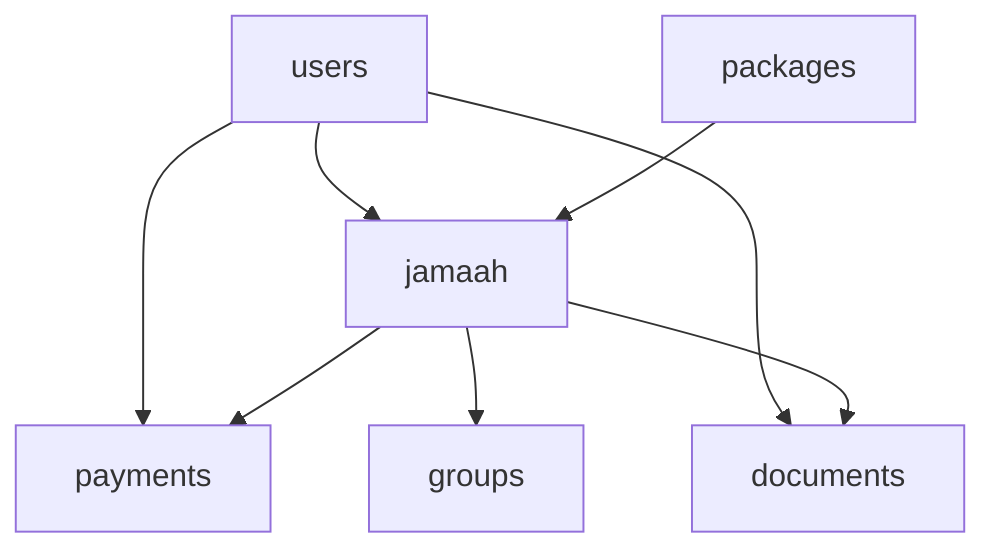

# 📊 DATABASE DOCUMENTATION - SISTEM MANAJEMEN UMROH

## 🎯 **OVERVIEW**

Database ini dirancang untuk mengelola **50,000+ jamaah per tahun** dengan struktur yang powerful, scalable, dan maintainable. Menggunakan MySQL dengan fitur-fitur enterprise untuk performa optimal.

---

## 🏗️ **ARCHITECTURE OVERVIEW**

### **Database Engine:** MySQL 8.0+
### **Character Set:** utf8mb4_unicode_ci
### **Storage Engine:** InnoDB
### **Total Tables:** 25+ tables
### **Key Features:**
- ✅ **ACID Compliance**
- ✅ **Foreign Key Constraints**
- ✅ **Audit Trails**
- ✅ **Automated Triggers**
- ✅ **Stored Procedures**
- ✅ **Partitioning**
- ✅ **Full-text Search**
- ✅ **Event Scheduling**

---

## 📋 **TABLE STRUCTURE OVERVIEW**

### **1. MASTER TABLES** (Core References)
```
├── roles                    # User roles & permissions
├── provinces               # Indonesian provinces  
├── cities                  # Cities per province
├── districts               # Districts per city
├── package_categories      # Umroh package categories
├── airlines               # Airlines master data
├── hotels                 # Makkah & Madinah hotels
└── document_types         # Required document types
```

### **2. USER MANAGEMENT**
```
├── users                  # System users
└── user_sessions         # Active user sessions
```

### **3. PACKAGE MANAGEMENT** 
```
├── packages              # Umroh packages
└── package_addons        # Optional package add-ons
```

### **4. JAMAAH (PILGRIM) MANAGEMENT** ⭐ **CORE TABLE**
```
├── jamaah                # Main pilgrim data (50+ fields)
└── jamaah_status_history # Status change tracking
```

### **5. DOCUMENT MANAGEMENT**
```
├── documents             # Uploaded documents
└── document_types        # Document type definitions
```

### **6. PAYMENT MANAGEMENT**
```
├── payment_methods       # Available payment methods
├── payments              # Payment transactions
├── payment_plans         # Installment plans
└── payment_installments  # Individual installments
```

### **7. GROUP MANAGEMENT**
```
├── groups                # Departure groups
└── group_member_history  # Group assignment history
```

### **8. REPORTING & ANALYTICS**
```
├── reports               # Report definitions
└── report_executions     # Report execution logs
```

### **9. AUDIT & LOGGING**
```
├── audit_logs            # Complete audit trail
└── system_logs           # System activity logs
```

### **10. NOTIFICATIONS**
```
├── notification_templates # Email/SMS templates
└── notifications         # Sent notifications
```

### **11. SYSTEM MANAGEMENT**
```
├── system_settings       # Application configuration
└── backup_logs           # Backup operation logs
```

---

## 🔗 **KEY RELATIONSHIPS**

### **Primary Relationships:**


### **Complex Relationships:**
- **Jamaah ↔ Packages:** Many-to-One (jamaah belongs to package)
- **Jamaah ↔ Groups:** Many-to-One (jamaah assigned to group)
- **Jamaah ↔ Payments:** One-to-Many (multiple payments per jamaah)
- **Jamaah ↔ Documents:** One-to-Many (multiple documents per jamaah)
- **Jamaah ↔ Jamaah:** Self-referencing (mahram relationships)

---

## 📊 **JAMAAH TABLE DEEP DIVE** ⭐

### **Core Fields (50+ columns):**

#### **🔍 IDENTIFICATION:**
```sql
- id (Primary Key)
- registration_number (Unique: UMR202412000001)
- nik (Unique Indonesian ID)
- full_name
- passport_number (Unique)
```

#### **👤 PERSONAL INFO:**
```sql
- date_of_birth, place_of_birth
- gender (male/female)
- marital_status (single/married/divorced/widowed)
- occupation, education
- height, weight, blood_type
```

#### **📍 LOCATION:**
```sql
- province_id, city_id, district_id
- ktp_address, current_address
- postal_code
```

#### **📞 CONTACT:**
```sql
- phone, whatsapp, email
- emergency_contact_name
- emergency_contact_phone
- emergency_contact_relation
```

#### **🏥 MEDICAL:**
```sql
- medical_conditions
- medications
- allergies
- dietary_restrictions
- mobility_assistance
```

#### **📄 DOCUMENTS:**
```sql
- passport_number, passport_issued_date, passport_expiry_date
- visa_number, visa_issued_date, visa_expiry_date
- passport_photo_url, visa_photo_url
```

#### **👨‍👩‍👧‍👦 FAMILY:**
```sql
- is_mahram
- mahram_jamaah_id (FK to jamaah.id)
- family_group_code
```

#### **🏨 ACCOMMODATION:**
```sql
- room_preference (single/double/triple/quad)
- roommate_request
- special_accommodation_needs
```

#### **💰 FINANCIAL:**
```sql
- total_amount
- amount_paid
- amount_due (GENERATED COLUMN)
- payment_status (pending/partial/paid/overpaid/refunded)
```

#### **📊 STATUS TRACKING:**
```sql
- registration_status (draft/submitted/verified/approved/rejected/cancelled)
- document_status (incomplete/submitted/verified/approved/rejected)
- visa_status (not_applied/applied/in_process/approved/rejected/expired)
- medical_check_status (not_done/scheduled/completed/approved/rejected)
```

#### **👥 GROUP ASSIGNMENT:**
```sql
- group_id (FK to groups.id)
- seat_number
- room_number
- bed_assignment
```

### **Advanced Features:**
- **Computed Columns:** `amount_due` auto-calculated
- **Full-text Search:** On name, phone, email
- **Constraints:** Age validation, phone format validation
- **Triggers:** Auto-update package capacity, audit logging

---

## 🔐 **SECURITY FEATURES**

### **Data Protection:**
- **Password Hashing:** bcrypt with salt
- **Session Management:** Token-based with expiration
- **Audit Trail:** Every data change logged
- **Soft Delete:** No permanent data deletion
- **Data Encryption:** Sensitive fields can be encrypted

### **Access Control:**
- **Role-based Permissions:** 8 predefined roles
- **Session Timeout:** Configurable timeout
- **Login Attempts:** Account locking after failed attempts
- **IP Tracking:** All activities logged with IP

### **Data Integrity:**
- **Foreign Key Constraints:** Referential integrity
- **Check Constraints:** Data validation at DB level
- **Unique Constraints:** Prevent duplicates
- **NOT NULL Constraints:** Required field enforcement

---

## ⚡ **PERFORMANCE OPTIMIZATION**

### **Indexing Strategy:**
```sql
-- Primary Indexes
- PRIMARY KEY indexes on all tables
- UNIQUE indexes on business keys (NIK, passport, registration_number)

-- Search Indexes
- idx_jamaah_package_status (package_id, registration_status, payment_status)
- idx_jamaah_created_at (created_at)
- idx_payments_jamaah_status (jamaah_id, status, payment_date)

-- Full-text Indexes
- ft_jamaah_search (full_name, phone, email)
- ft_packages_search (name, description)

-- Foreign Key Indexes (auto-created)
- All FK relationships indexed for JOIN performance
```

### **Partitioning:**
```sql
-- audit_logs table partitioned by month
PARTITION BY RANGE (YEAR(created_at) * 100 + MONTH(created_at))
- Improves query performance on large audit data
- Easier data archival and cleanup
```

### **Query Optimization:**
- **Composite Indexes:** Multi-column indexes for complex queries
- **Covering Indexes:** Reduce I/O operations
- **Materialized Views:** Pre-computed aggregations

---

## 🔄 **AUTOMATION FEATURES**

### **Triggers:**
```sql
1. tr_jamaah_audit_insert/update
   - Auto-log all jamaah changes

2. tr_payment_update_jamaah  
   - Auto-update payment status when payment approved

3. tr_jamaah_package_capacity
   - Auto-update package booking count

4. tr_group_member_count
   - Auto-update group member count
```

### **Stored Procedures:**
```sql
1. sp_register_jamaah()
   - Complete jamaah registration with validation

2. sp_process_payment()
   - Payment processing with business rules

3. sp_create_departure_group()
   - Group creation with validation

4. sp_assign_jamaah_to_group()
   - Group assignment with capacity checking

5. sp_generate_jamaah_report()
   - Comprehensive reporting

6. sp_create_backup()
   - Automated backup initiation
```

### **Scheduled Events:**
```sql
1. ev_cleanup_sessions (Daily)
   - Remove expired user sessions

2. ev_cleanup_audit_logs (Monthly)  
   - Archive old audit logs

3. ev_update_package_status (Daily)
   - Update package status based on dates

4. ev_payment_reminders (Daily)
   - Send payment reminders
```

---

## 📈 **SCALABILITY FEATURES**

### **For 50,000+ Jamaah/Year:**

#### **Database Design:**
- **Normalized Structure:** Reduces data redundancy
- **Efficient Indexing:** Fast query execution
- **Partitioning:** Handle large tables
- **Connection Pooling:** Efficient resource usage

#### **Performance Monitoring:**
- **Query Performance:** Slow query logging
- **Index Usage:** Monitor index effectiveness  
- **Storage Growth:** Track table sizes
- **Connection Metrics:** Monitor database connections

#### **Backup & Recovery:**
- **Automated Backups:** Daily full, hourly incremental
- **Point-in-time Recovery:** Restore to any point
- **Backup Verification:** Automated backup testing
- **Disaster Recovery:** Multi-region backup storage

---

## 🛠️ **MAINTENANCE PROCEDURES**

### **Daily Maintenance:**
```sql
-- Check database health
SHOW ENGINE INNODB STATUS;

-- Monitor table sizes
SELECT table_name, 
       ROUND(((data_length + index_length) / 1024 / 1024), 2) AS "Size in MB"
FROM information_schema.TABLES 
WHERE table_schema = 'umroh_management_v2'
ORDER BY (data_length + index_length) DESC;

-- Check for slow queries
SELECT * FROM mysql.slow_log ORDER BY start_time DESC LIMIT 10;
```

### **Weekly Maintenance:**
```sql
-- Analyze table statistics
ANALYZE TABLE jamaah, payments, documents, audit_logs;

-- Optimize tables if needed
OPTIMIZE TABLE audit_logs;

-- Check for fragmentation
SELECT table_name, 
       ROUND(data_free / 1024 / 1024, 2) AS "Fragmentation in MB"
FROM information_schema.TABLES 
WHERE table_schema = 'umroh_management_v2' 
AND data_free > 0;
```

### **Monthly Maintenance:**
```sql
-- Archive old audit logs
CALL sp_archive_audit_logs();

-- Update table statistics
UPDATE mysql.innodb_table_stats SET last_update = NOW();

-- Check backup integrity
CALL sp_verify_backups();
```

---

## 📊 **REPORTING VIEWS**

### **Pre-built Views for Analytics:**

#### **1. vw_jamaah_complete**
Complete jamaah information with all relationships
```sql
SELECT * FROM vw_jamaah_complete 
WHERE package_name = 'Umroh Ramadhan 2024';
```

#### **2. vw_payment_summary**  
Payment status and financial summary
```sql
SELECT * FROM vw_payment_summary 
WHERE payment_status = 'partial';
```

#### **3. vw_package_capacity**
Package capacity and occupancy
```sql
SELECT * FROM vw_package_capacity 
WHERE occupancy_percentage > 80;
```

#### **4. vw_document_completion**
Document submission progress
```sql
SELECT * FROM vw_document_completion 
WHERE completion_status = 'Incomplete';
```

---

## 🔍 **COMMON QUERIES**

### **Business Intelligence Queries:**

#### **Daily Registration Report:**
```sql
SELECT 
    DATE(created_at) as date,
    COUNT(*) as registrations,
    SUM(total_amount) as total_value
FROM jamaah 
WHERE created_at >= DATE_SUB(NOW(), INTERVAL 30 DAY)
GROUP BY DATE(created_at)
ORDER BY date DESC;
```

#### **Payment Collection Report:**
```sql
SELECT 
    DATE(payment_date) as date,
    COUNT(*) as payment_count,
    SUM(amount) as total_collected
FROM payments 
WHERE status = 'approved'
AND payment_date >= DATE_SUB(NOW(), INTERVAL 30 DAY)
GROUP BY DATE(payment_date)
ORDER BY date DESC;
```

#### **Package Performance:**
```sql
SELECT 
    p.name,
    p.max_capacity,
    COUNT(j.id) as bookings,
    ROUND((COUNT(j.id) / p.max_capacity) * 100, 2) as occupancy_rate,
    SUM(j.amount_paid) as revenue_collected
FROM packages p
LEFT JOIN jamaah j ON p.id = j.package_id
WHERE p.departure_date >= CURDATE()
GROUP BY p.id, p.name, p.max_capacity
ORDER BY occupancy_rate DESC;
```

---

## 🚨 **MONITORING & ALERTS**

### **Key Metrics to Monitor:**

#### **Performance Metrics:**
- Query response time < 1 second
- Database connections < 80% of max
- Table lock wait time < 100ms
- Disk I/O utilization < 80%

#### **Business Metrics:**
- Daily registration count
- Payment collection rate
- Document approval rate
- System error rate < 1%

#### **Data Quality Metrics:**
- Duplicate NIK detection
- Incomplete registrations
- Payment discrepancies
- Document expiry alerts

---

## 📚 **USAGE EXAMPLES**

### **1. Register New Jamaah:**
```sql
CALL sp_register_jamaah(
    1,                          -- package_id
    'Ahmad Fauzi',             -- full_name  
    '1234567890123456',        -- nik
    '1985-05-15',              -- date_of_birth
    'male',                    -- gender
    '081234567890',            -- phone
    'ahmad@email.com',         -- email
    1,                         -- registered_by
    @reg_number,               -- OUT registration_number
    @jamaah_id,                -- OUT jamaah_id
    @result_code,              -- OUT result_code
    @result_message            -- OUT result_message
);
```

### **2. Process Payment:**
```sql
CALL sp_process_payment(
    123,                       -- jamaah_id
    1,                         -- payment_method_id
    5000000.00,               -- amount
    'TRF20241221001',         -- reference_number
    'Bank BCA',               -- bank_name
    1,                        -- processed_by
    @payment_id,              -- OUT payment_id
    @result_code,             -- OUT result_code
    @result_message           -- OUT result_message
);
```

### **3. Create Departure Group:**
```sql
CALL sp_create_departure_group(
    1,                         -- package_id
    'Grup Ramadhan A1',       -- name
    45,                       -- max_members
    '2024-03-15 04:00:00',    -- departure_time
    'Masjid Istiqlal',        -- meeting_point
    1,                        -- created_by
    @group_id,                -- OUT group_id
    @group_code,              -- OUT group_code
    @result_code,             -- OUT result_code
    @result_message           -- OUT result_message
);
```

---

## 🔧 **INSTALLATION & SETUP**

### **1. Create Database:**
```bash
mysql -u root -p < comprehensive-schema.sql
```

### **2. Setup Triggers & Procedures:**
```bash
mysql -u root -p umroh_management_v2 < triggers-procedures.sql
```

### **3. Configure MySQL Settings:**
```ini
[mysqld]
innodb_buffer_pool_size = 2G
innodb_log_file_size = 512M
innodb_flush_log_at_trx_commit = 2
max_connections = 200
query_cache_size = 128M
```

### **4. Create Application User:**
```sql
CREATE USER 'umroh_app'@'localhost' IDENTIFIED BY 'secure_password';
GRANT SELECT, INSERT, UPDATE, DELETE ON umroh_management_v2.* TO 'umroh_app'@'localhost';
GRANT EXECUTE ON umroh_management_v2.* TO 'umroh_app'@'localhost';
FLUSH PRIVILEGES;
```

---

## 📋 **MIGRATION GUIDE**

### **From Existing System:**

#### **1. Data Migration Steps:**
```sql
-- Step 1: Export existing data
-- Step 2: Map old schema to new schema  
-- Step 3: Transform data format
-- Step 4: Import with validation
-- Step 5: Verify data integrity
```

#### **2. Zero-Downtime Migration:**
- Setup replication
- Sync data incrementally  
- Switch application endpoint
- Verify data consistency

---

## 🎯 **CONCLUSION**

Database ini dirancang sebagai **enterprise-grade solution** yang mampu:

✅ **Mengelola 50,000+ jamaah per tahun**
✅ **Menjamin data integrity & security**  
✅ **Memberikan performa optimal**
✅ **Mendukung scalability horizontal & vertikal**
✅ **Menyediakan audit trail lengkap**
✅ **Automasi proses bisnis**
✅ **Comprehensive reporting**

**Database ini siap untuk produksi** dengan standar enterprise dan dapat di-scale sesuai pertumbuhan bisnis.

---

## 📞 **SUPPORT**

Untuk pertanyaan teknis atau dukungan implementasi:
- 📧 **Email:** database-support@umrohmandiri.com  
- 📱 **Phone:** +62-21-12345678
- 📚 **Documentation:** [Internal Wiki Link]

---

*🔄 Last Updated: December 2024*
*📝 Version: 2.0*
*👨‍💻 Maintained by: Database Team*